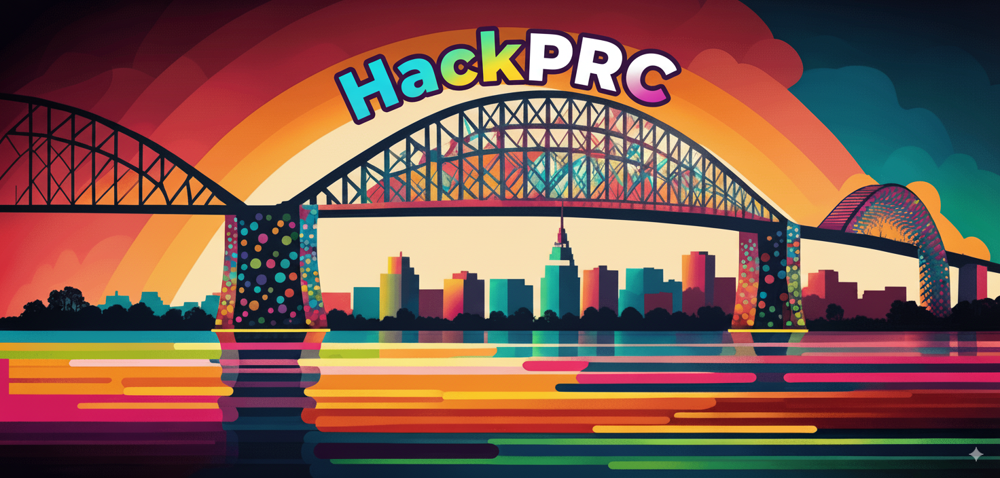

= HackPRC25 Biohackathon
:toc: left
:icons: font
:sectanchors:
:source-highlighter: coderay

[.lead]
Following the HPRC25 conference, we are organizing a biohackathon focused on pangenomic software tools and collaborative development.

== Registration

[.lead]
Registration is required and space is limited to 30 participants.

📝 https://docs.google.com/forms/d/e/1FAIpQLSfGgCUiDAwmUshIgNzc3KSvCeWBUcKg204XcI_0yM_8CaIcgA/viewform?usp=header[Register Here^]

== Important Dates

[cols="2,3", options="header"]
|===
| Date | Event
| October 8-9, 2025 | HackPRC25 Biohackathon
|===

== Venue

*Location*: Rooms 100-101, Translational Research Science Building (TRSB) +
*Format*: Collaborative software development and biohackathon +
*Capacity*: Limited to 30 participants

== Program Schedule

=== Day 1 - October 8, 2025

[cols="1,4", options="header"]
|===
| Time | Activity
| 9:00-9:30 | Opening Remarks & Introduction
| 9:30-10:30 | Project Pitches & Team Formation
| 10:30-11:00 | Coffee Break ☕
| 11:00-12:30 | Hacking Session 1
| 12:30-13:30 | Lunch Break 🍽️
| 13:30-15:00 | Hacking Session 2
| 15:00-15:30 | Coffee Break ☕
| 15:30-16:30 | Hacking Session 3
| 16:30-17:00 | Daily Wrap-up & Progress Reports
| 18:00 | Group Dinner (optional)
|===

=== Day 2 - October 9, 2025

[cols="1,4", options="header"]
|===
| Time | Activity
| 9:00-9:30 | Daily Kickoff
| 9:30-11:00 | Hacking Session 4
| 11:00-11:30 | Coffee Break ☕
| 11:30-13:00 | Hacking Session 5
| 13:00-14:00 | Lunch Break 🍽️
| 14:00-15:00 | Final Development Sprint
| 15:00-15:30 | Coffee Break ☕
| 15:30-16:30 | Project Presentations
| 16:30-17:00 | Closing Remarks
|===

== What to Expect

The HackPRC25 biohackathon will bring together researchers, developers, and bioinformaticians to work on:

* Pangenomic software tools development
* Data analysis pipelines
* Visualization tools
* Performance optimization
* Documentation and testing

=== Who Should Attend

This biohackathon is designed for:

* Computational biologists working with pangenomes
* Software developers interested in genomics
* Researchers with active pangenome projects
* Students and postdocs in related fields

=== Prerequisites

* Experience with Linux and command-line tools
* Familiarity with genomic data formats
* Programming experience (Python, Rust, C++, or similar)
* Basic knowledge of version control (Git)

---

This biohackathon is organized as a follow-up to the HPRC25 conference, providing an opportunity for hands-on collaboration and software development in the pangenomics community.